# SK-MediaFlow

`SK-MediaFlow` is a full-stack video platform for publishing, organizing, streaming, and managing media at individual, organization, and platform-admin levels. The current codebase combines creator workflows, AI-assisted metadata, S3-backed ingestion, background processing, and analytics-oriented administration in a single product surface.

## What The Project Currently Includes

- Email/password authentication with OTP verification, password reset, and Google OAuth
- User profiles with avatar and cover management
- Channel-based publishing
- Direct video uploads with presigned S3 URLs
- S3 bucket registration, scanning, and selective import
- Public, private, and organization-scoped video visibility
- Landscape and portrait playback flows
- AI-generated transcript, title, description, keywords, and tags
- Spritesheet generation and frame-based thumbnail selection
- Reactions, comments, shares, favorites, playlists, and watch history
- Organization creation, join flows, invite flows, uploader policy controls, and dashboard metrics
- Platform admin analytics, subscription visibility, and admin access management
- Real-time processing updates through Socket.IO

## Architecture

### Frontend

- React 19
- TypeScript
- Vite 7
- React Router 7
- Axios
- Socket.IO client
- Tailwind CSS 4
- Framer Motion

### Backend

- Node.js
- Express
- TypeScript
- Prisma ORM
- MongoDB
- BullMQ with Redis
- AWS S3
- CloudFront signed delivery
- FFmpeg and ffprobe
- Passport Google OAuth
- JWT-based auth flows

### AI And Processing

- External AI service integration through backend AI modules
- Queue-backed workers for thumbnailing, AI enrichment, and technical metadata extraction
- Post-upload media orchestration for optimization, spritesheets, and downstream jobs

## Project Flowchart

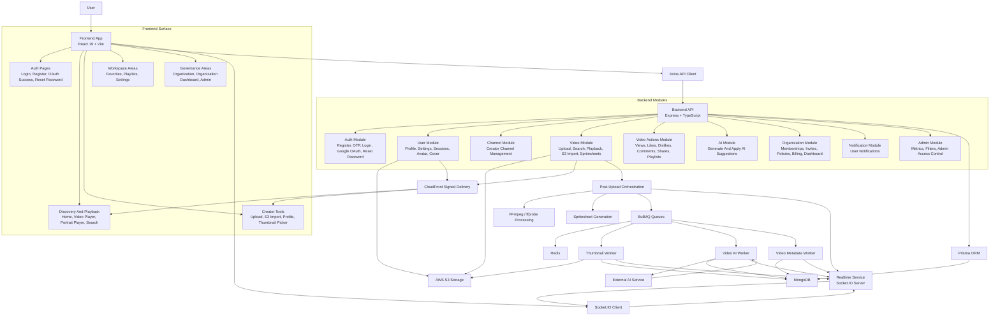

## Detailed Flowcharts

### Authentication flow

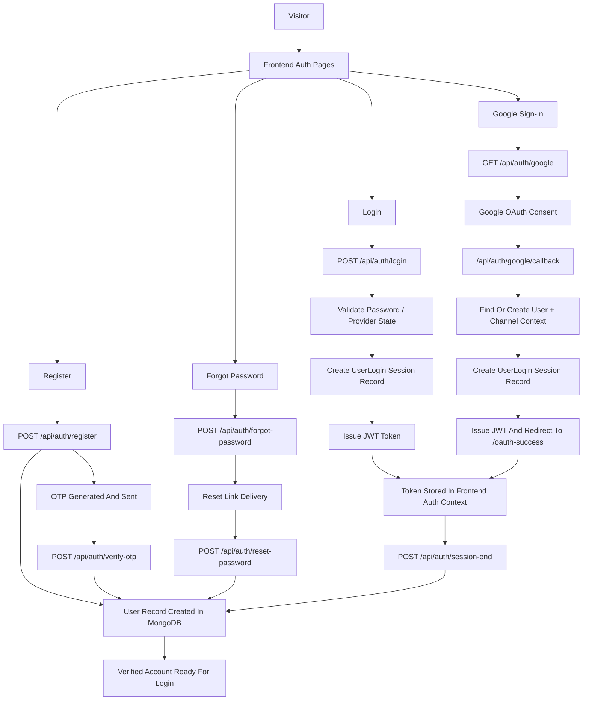

### User settings and security flow

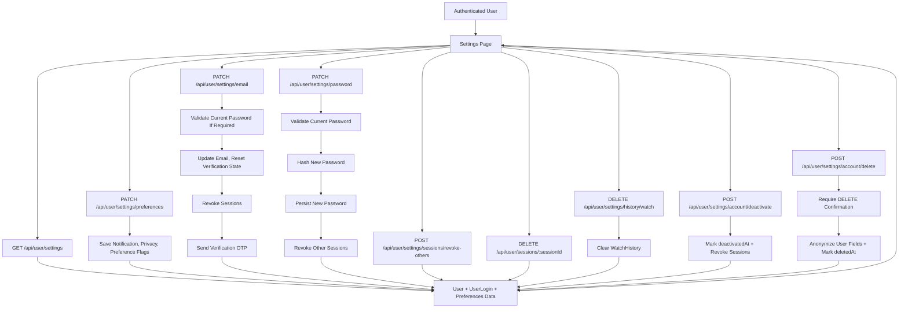

### Profile and media management flow

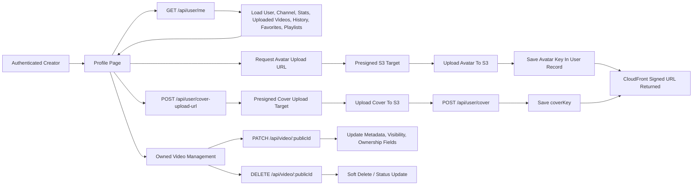

### S3 import flow

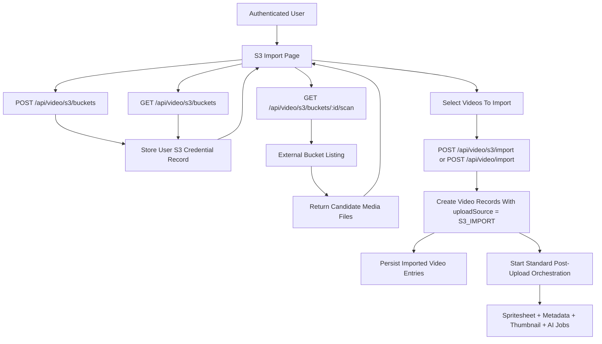

### Playback access flow

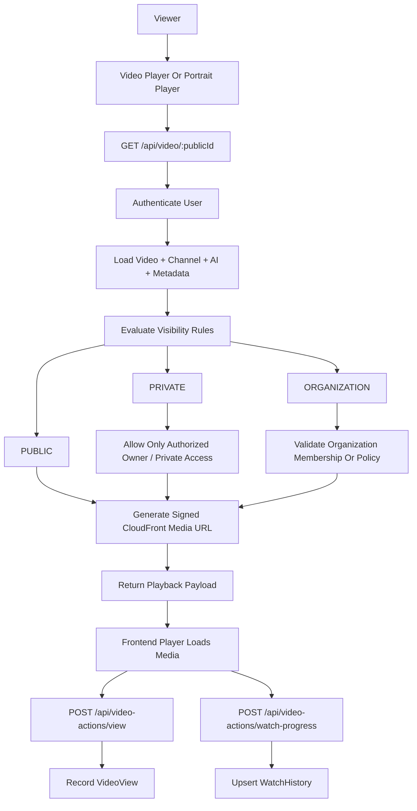

### Video interaction and analytics flow

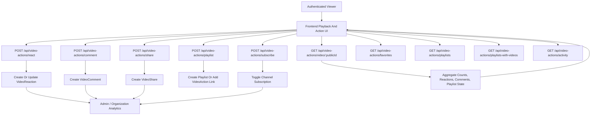

### AI suggestion lifecycle

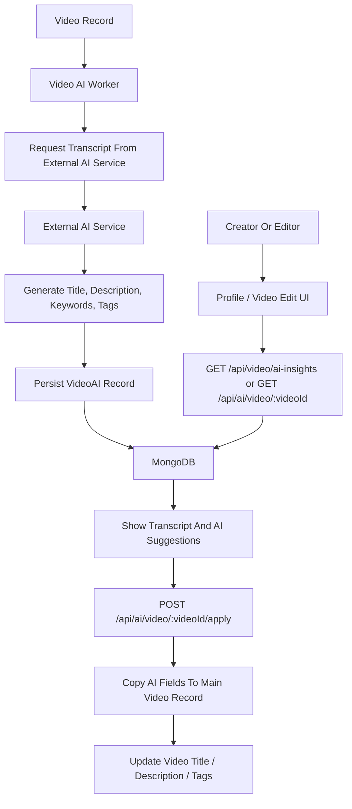

### Notification flow

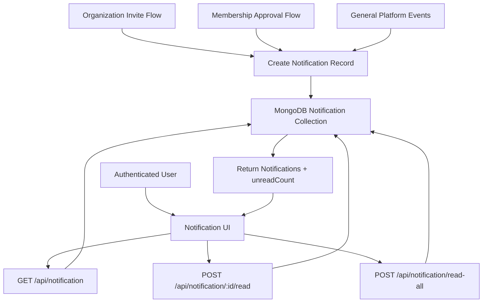

## Repository Layout

```text
SK-MediaFlow/
├── README.md
├── PROJECT_OVERVIEW.md
├── SETUP_GUIDE.md
├── SKILLS_DEVELOPED.md
├── WHISPER_OLLAMA_USAGE.md
├── backend/
└── frontend/
```

## Frontend Surface

The frontend is a protected single-page application centered on content discovery, playback, upload, and account management.

Key routes implemented in `frontend/src/App.tsx`:

- `/login`
- `/register`
- `/oauth-success`
- `/reset-password`
- `/video/:publicId`
- `/portrait`
- `/portrait/:publicId`
- `/home`
- `/upload`
- `/s3-import`
- `/favorites`
- `/playlists`
- `/profile`
- `/settings`
- `/search`
- `/organization`
- `/organization/dashboard`
- `/admin`

Main frontend areas:

- `frontend/src/pages` for product screens
- `frontend/src/components` for reusable media and navigation UI
- `frontend/src/layouts` for authenticated app shells
- `frontend/src/context` for auth and layout state
- `frontend/src/api` for backend integration

Notable user-facing experiences:

- cinematic home feed with hero and row-based discovery
- upload workflow with processing progress and thumbnail selection
- S3 import workflow for existing bucket media
- profile library management for uploaded videos
- account settings covering notifications, privacy, preferences, sessions, and account lifecycle actions
- organization workspace and organization dashboard views
- platform admin reporting dashboard

## Backend Surface

The backend is an Express API with modular domain areas and background workers.

Mounted API prefixes in `backend/src/app.ts`:

- `/api/auth`
- `/api/user`
- `/api/video`
- `/api/channel`
- `/api/ai`
- `/api/video-actions`
- `/api/organization`
- `/api/notification`
- `/api/admin`

Primary backend domains:

- `backend/src/modules/auth`
  Registration, OTP verification, login, password reset, session-end tracking, and Google OAuth

- `backend/src/modules/user`
  Profile data, avatar and cover updates, settings, session management, watch history cleanup, and account deactivate/delete actions

- `backend/src/modules/channel`
  Channel creation and maintenance

- `backend/src/modules/video`
  Upload completion, listing, search, portrait feeds, channel-scoped listings, spritesheet retrieval, thumbnail saving, owned-video updates, deletion, and S3 import helpers

- `backend/src/modules/video/video-action.*`
  Interaction flows such as views, likes, dislikes, comments, shares, watch events, and playlist linkage

- `backend/src/modules/organization`
  Organization creation, join links, invite workflows, member approval, uploader permissions, billing and subscription state, and organization-level content analytics

- `backend/src/modules/admin`
  Platform metrics, filter data, privileged user management, and admin access audit tracking

- `backend/src/modules/notification`
  Notification retrieval and state updates

- `backend/src/modules/ai`
  AI metadata generation and application flows for videos

## Data Model Highlights

The Prisma schema in `backend/prisma/schema.prisma` models:

- users, login sessions, and channels
- videos, AI records, and technical metadata
- reactions, comments, shares, watch history, and playlists
- organizations, memberships, invites, uploader access, and subscription state
- notifications
- admin access audits
- user-scoped S3 credentials

Video visibility supports:

- `PUBLIC`
- `PRIVATE`
- `ORGANIZATION`

Upload sources support:

- `MANUAL`
- `S3_IMPORT`

## Media Pipeline

Current upload and processing flow:

1. The client requests a presigned upload target.
2. The media file is uploaded to S3.
3. The client finalizes the upload with the API.
4. The backend creates the video record and starts post-upload orchestration.
5. Processing generates optimized media outputs and a spritesheet.
6. Background jobs enrich AI data, thumbnails, and technical metadata.
7. Real-time events report progress back to the frontend.

Upload processing flow:

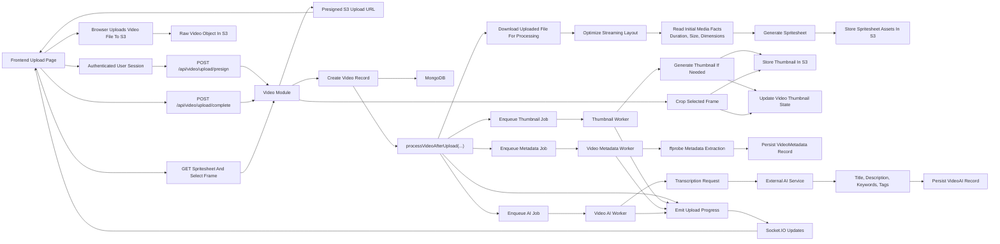

Organization and admin flow:

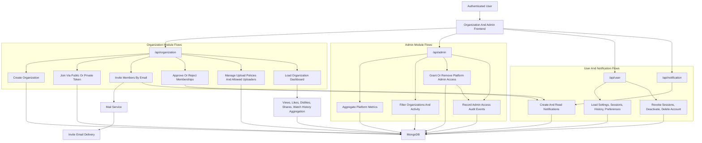

Current media-related capabilities in the codebase:

- presigned video uploads
- presigned thumbnail uploads
- spritesheet retrieval for frame picking
- CloudFront signed access for protected assets
- technical metadata extraction including duration, dimensions, codecs, and orientation

## Background Jobs And Workers

Worker entrypoint:

- `backend/src/workers/index.ts`

Registered worker areas:

- `backend/src/workers/thumbnail.worker.ts`
- `backend/src/workers/video-ai.worker.ts`
- `backend/src/workers/video-metadata.worker.ts`

These workers back the asynchronous parts of the media pipeline and keep expensive processing out of the request path.

## Operational Notes

- Prisma is configured for MongoDB.
- Media storage and generated assets are designed around S3 plus CloudFront delivery.
- AI enrichment is not self-contained in this repository; it depends on an external service integration.
- The application uses both HTTP APIs and Socket.IO to complete the upload and processing experience.
- Setup steps and environment details are intentionally not included in this README.

## Additional Documentation

- [PROJECT_OVERVIEW.md](./PROJECT_OVERVIEW.md)
- [SETUP_GUIDE.md](./SETUP_GUIDE.md)
- [WHISPER_OLLAMA_USAGE.md](./WHISPER_OLLAMA_USAGE.md)
- [SKILLS_DEVELOPED.md](./SKILLS_DEVELOPED.md)
