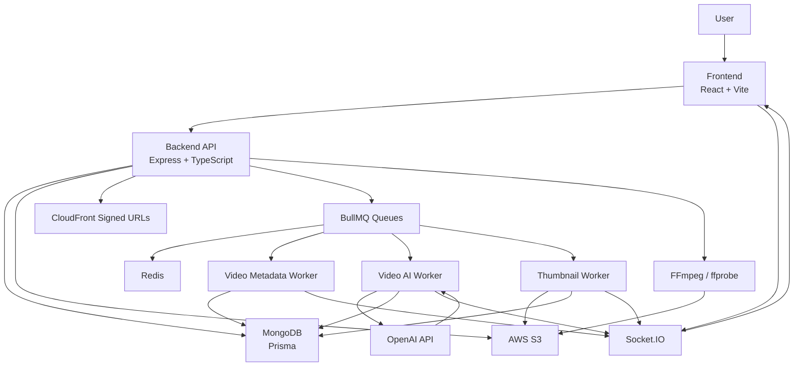
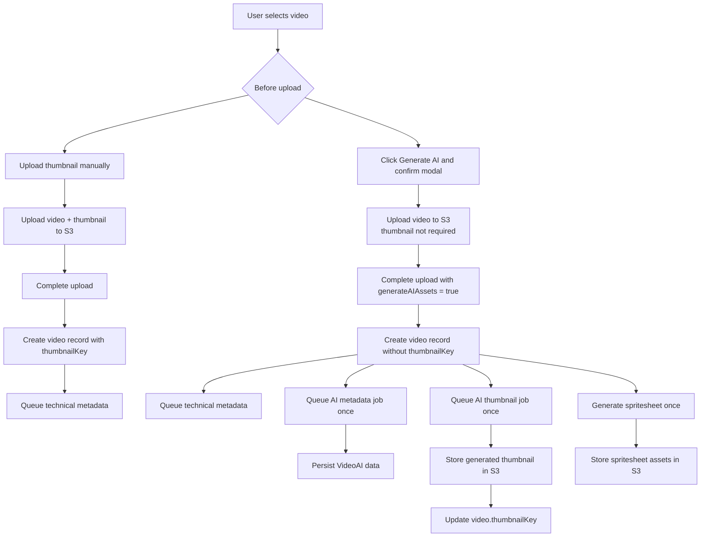

# SK-MediaFlow

`SK-MediaFlow` is a full-stack video publishing and streaming platform with creator uploads, S3-backed storage, CloudFront delivery, organization workflows, AI-assisted metadata generation, AI thumbnail generation, spritesheet frame picking, and real-time processing updates.

## Current Capabilities

- Email/password auth, OTP verification, password reset, Google OAuth, and session tracking
- User profiles with avatar and cover uploads
- Channel-based video publishing
- Manual video upload through presigned S3 URLs
- Required thumbnail handling, with an AI-generation alternative during upload
- S3 bucket registration, scanning, and selective import
- Public, private, and organization-scoped video visibility
- Landscape and portrait playback
- AI-generated transcript, title, description, keywords, and tags
- AI thumbnail generation when selected before upload
- Spritesheet generation for frame-based thumbnail selection
- Reactions, comments, shares, favorites, playlists, watch history, and subscriptions
- Organization creation, join flows, invites, uploader policies, dashboards, and metrics
- Platform admin analytics and access management
- Socket.IO progress events for upload, AI, thumbnail, and processing state

## Tech Stack

### Frontend

- React 19
- TypeScript
- Vite 7
- React Router 7
- Axios
- Socket.IO client
- Tailwind CSS 4
- Framer Motion
- Lucide icons

### Backend

- Node.js
- Express
- TypeScript
- Prisma ORM
- MongoDB
- BullMQ
- Redis
- AWS S3
- CloudFront signed URLs
- FFmpeg and ffprobe through the backend FFmpeg config
- OpenAI API for AI transcription and metadata generation
- Passport Google OAuth
- JWT auth

## Repository Layout

```text
SK-MediaFlow/
├── README.md
├── backend/
│   ├── prisma/
│   └── src/
│       ├── modules/
│       ├── workers/
│       ├── queues/
│       ├── services/
│       └── config/
└── frontend/
    └── src/
        ├── components/
        ├── pages/
        ├── layouts/
        ├── context/
        └── api/
```

## High-Level Architecture



## Upload And AI Flow

The upload flow is intentionally user-driven. AI processing and AI thumbnail generation do not start automatically just because a video was uploaded.

### Manual thumbnail path

1. The user selects a video.
2. The user uploads a thumbnail image.
3. The frontend uploads the video to S3 with a presigned URL.
4. The frontend uploads the thumbnail to S3 with a presigned URL.
5. The frontend completes the upload.
6. The backend creates the video record using the uploaded thumbnail.
7. Technical metadata extraction is queued.
8. AI metadata, AI thumbnail, and spritesheet generation do not start unless the user selected Generate AI.

### Generate AI path

1. The user selects a video.
2. The user clicks `Generate AI` before starting the upload.
3. A modal explains that AI will generate title, description, keywords, transcript data, an AI thumbnail, and a spritesheet.
4. The user confirms generation.
5. The frontend allows upload without a manual thumbnail.
6. The upload completion request includes `generateAIAssets: true`.
7. The backend creates the video record.
8. The backend queues AI metadata and AI thumbnail generation once.
9. The backend starts spritesheet generation once.
10. Socket.IO events update the upload UI as jobs progress.



## AI Processing Rules

AI work is explicit and guarded:

- AI processing starts only after a user confirms Generate AI.
- AI thumbnail generation starts only when Generate AI was selected and no manual thumbnail was uploaded.
- AI jobs are tagged with `requestedByUser: true`.
- AI and thumbnail workers skip jobs that are not tagged as user-requested.
- AI and thumbnail jobs use `attempts: 1`.
- Failed AI and thumbnail jobs are not retried automatically.
- Duplicate AI requests are blocked by stored status and deterministic job IDs.
- Generate AI is available in the upload flow, not on normal browsing video cards.

Technical metadata extraction is separate from AI enrichment. It may still be queued as part of upload/import processing because playback and layout features need duration, orientation, and media facts.

## AI Runtime

The production AI runtime uses the OpenAI API directly from the backend worker. It does not require an `AI_SERVER_URL`, Ollama server, or local Whisper process.

Relevant environment variables:

```env
OPENAI_API_KEY=...
OPENAI_TRANSCRIPTION_MODEL=gpt-4o-mini-transcribe
OPENAI_METADATA_MODEL=gpt-4o-mini
```

`OPENAI_TRANSCRIPTION_MODEL` and `OPENAI_METADATA_MODEL` are optional. The backend has defaults when they are not provided.

Relevant files:

- `backend/src/workers/video-ai.worker.ts`
- `backend/src/workers/thumbnail.worker.ts`
- `backend/src/modules/video/video-processing.service.ts`
- `backend/src/modules/video/video.controller.ts`
- `frontend/src/pages/Upload.tsx`
- `frontend/src/components/AIGenerateAction.tsx`

## Thumbnail Rules

- A thumbnail is required for published videos.
- The user can satisfy this requirement in either of two ways:
  - upload a thumbnail before upload
  - choose Generate AI before upload, which lets the AI thumbnail worker create the thumbnail after upload
- The selected manual thumbnail filename is shown in the upload row.
- If a manual thumbnail was uploaded, AI generation does not replace it automatically.
- Spritesheet frame selection can still be used later to save a different thumbnail frame.

## Background Jobs And Workers

Worker entrypoint:

- `backend/src/workers/index.ts`

Workers:

- `backend/src/workers/video-ai.worker.ts`
- `backend/src/workers/thumbnail.worker.ts`
- `backend/src/workers/video-metadata.worker.ts`

Queues:

- `videoAIQueue`
- `thumbnailQueue`
- `videoMetadataQueue`

AI and thumbnail queue behavior:

- `videoAIQueue` default attempts: `1`
- `thumbnailQueue` default attempts: `1`
- Explicitly queued AI and thumbnail jobs also set `attempts: 1`
- no retry backoff is configured for AI or thumbnail jobs

Real-time events used by the frontend:

- `ai-progress`
- `ai-completed`
- `ai-failed`
- `thumbnail-progress`
- `thumbnail-completed`
- `thumbnail-failed`

## Media Pipeline

Media-related backend features include:

- presigned video upload URLs
- presigned thumbnail upload URLs
- S3 upload completion
- CloudFront signed delivery URLs
- FFmpeg-based streaming optimization
- ffprobe-based technical metadata extraction
- spritesheet generation and metadata storage
- frame crop from spritesheet to thumbnail
- AI-generated thumbnail creation

## Backend Domains

- Auth module: register, OTP, login, Google OAuth, reset password, session tracking
- User module: profile, settings, avatar, cover, sessions, account lifecycle
- Channel module: creator channel management
- Video module: upload, listing, playback, search, S3 import, spritesheets, thumbnails, owned-video edits
- Video actions module: views, reactions, comments, shares, playlists, watch history
- Organization module: organizations, invites, membership approval, upload policies, dashboards
- Admin module: platform metrics, filters, admin access control
- Notification module: notification retrieval and state updates
- AI module: AI metadata generation and application flows

## Frontend Surface

Key routes:

- `/login`
- `/register`
- `/oauth-success`
- `/reset-password`
- `/home`
- `/upload`
- `/s3-import`
- `/video/:publicId`
- `/portrait`
- `/portrait/:publicId`
- `/favorites`
- `/playlists`
- `/profile`
- `/settings`
- `/search`
- `/organization`
- `/organization/dashboard`
- `/admin`

Notable frontend files:

- `frontend/src/pages/Upload.tsx`
- `frontend/src/components/AIGenerateAction.tsx`
- `frontend/src/components/SpritesheetPicker.tsx`
- `frontend/src/components/VideoRow.tsx`
- `frontend/src/components/VideoCard.tsx`
- `frontend/src/pages/ProfilePage.tsx`
- `frontend/src/pages/Search.tsx`
- `frontend/src/api/axios.ts`
- `frontend/src/context/AuthContext.tsx`

Frontend upload behavior:

- The upload row shows the selected thumbnail filename after the user chooses a file.
- `Generate AI` is available on the upload row before upload starts.
- If `Generate AI` is selected, the user can upload without choosing a thumbnail file.
- The upload request sends `generateAIAssets: true` when AI generation is selected.
- The Generate AI button is intentionally not shown on normal discovery, profile, or search video cards.

Frontend development:

```bash
cd frontend
npm install
npm run dev
```

## Runtime Requirements

Required infrastructure:

- MongoDB
- Redis
- AWS S3 bucket
- CloudFront distribution and signing keys
- OpenAI API key
- Email delivery configuration for OTP/password flows
- Google OAuth credentials if Google login is enabled

Important environment areas:

- database URL
- JWT secrets
- Redis connection
- AWS credentials and bucket
- CloudFront domain, key pair ID, and private key
- OpenAI API key and optional model names
- mail/OTP settings
- frontend and backend public URLs

## Verification Commands

Backend:

```bash
cd backend
npm run build
```

Frontend:

```bash
cd frontend
npm run build
```

## Operational Notes

- Prisma is configured for MongoDB.
- Media and generated assets are stored in S3 and served through signed CloudFront URLs.
- Workers must be running for metadata, AI, thumbnail, and processing jobs to complete.
- Redis must be available for BullMQ queues.
- AI generation requires `OPENAI_API_KEY`.
- AI and thumbnail processing is intentionally opt-in and single-attempt.
- Normal video cards do not show Generate AI; the decision is made during upload.
