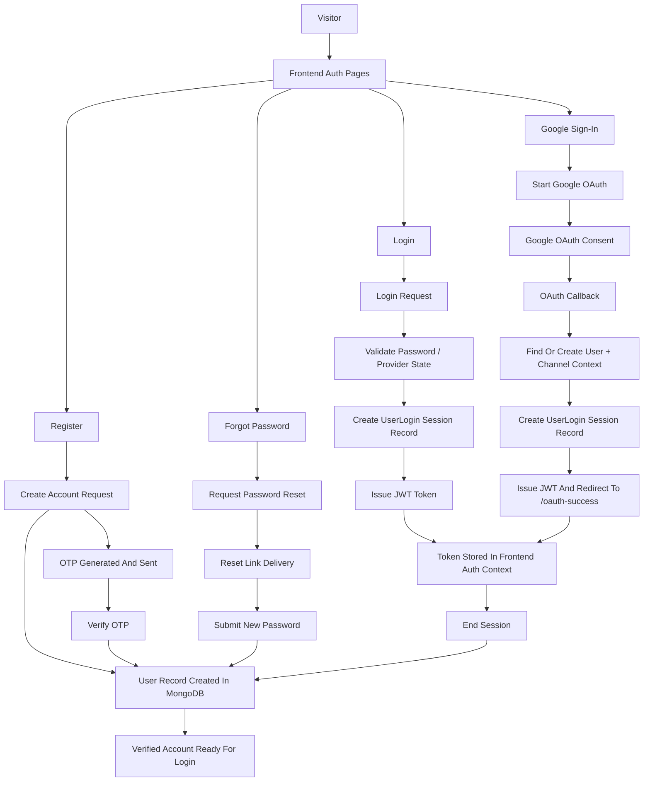
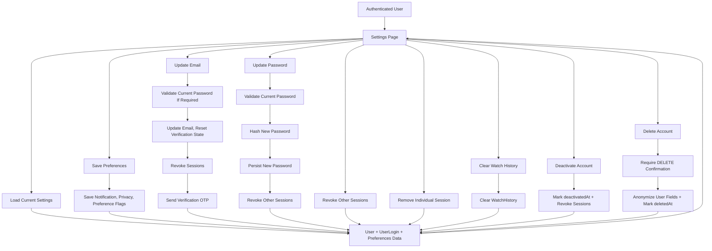
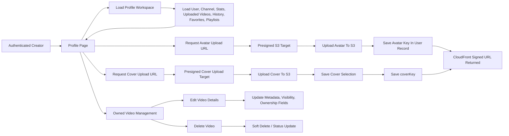
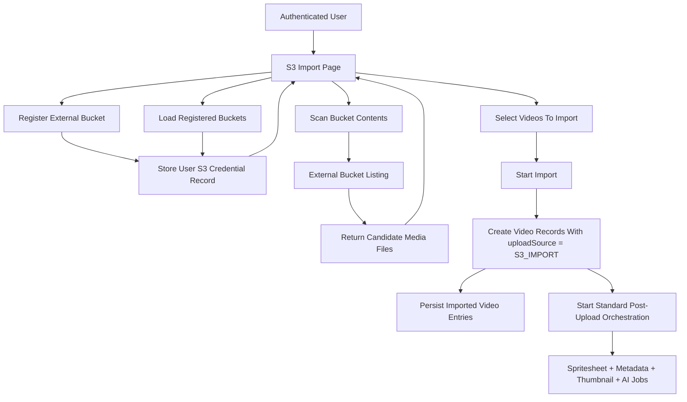
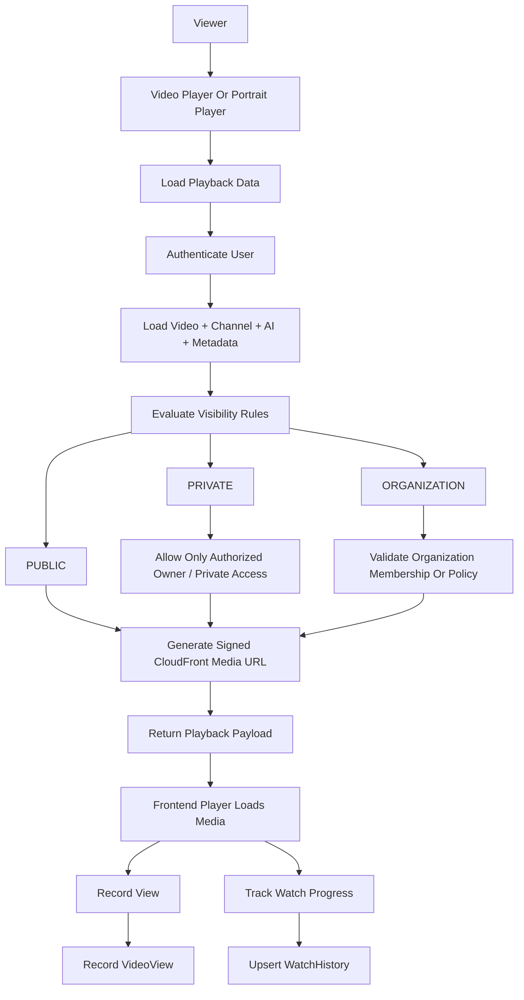
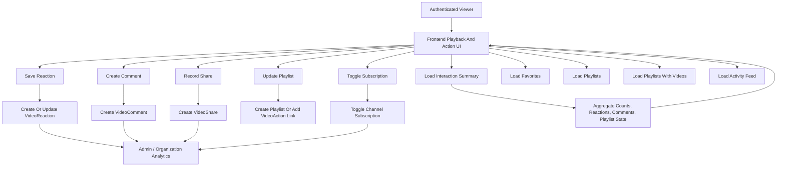
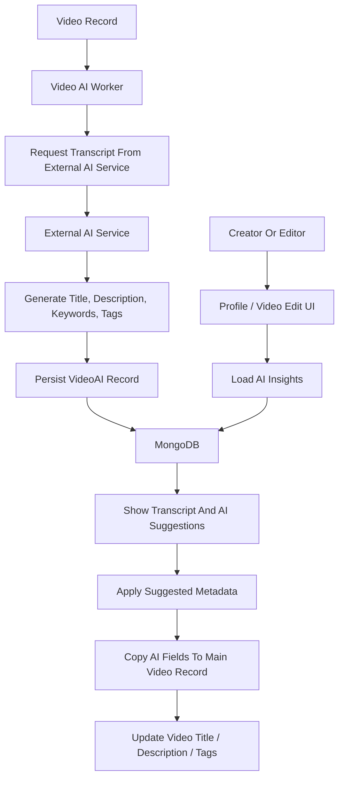
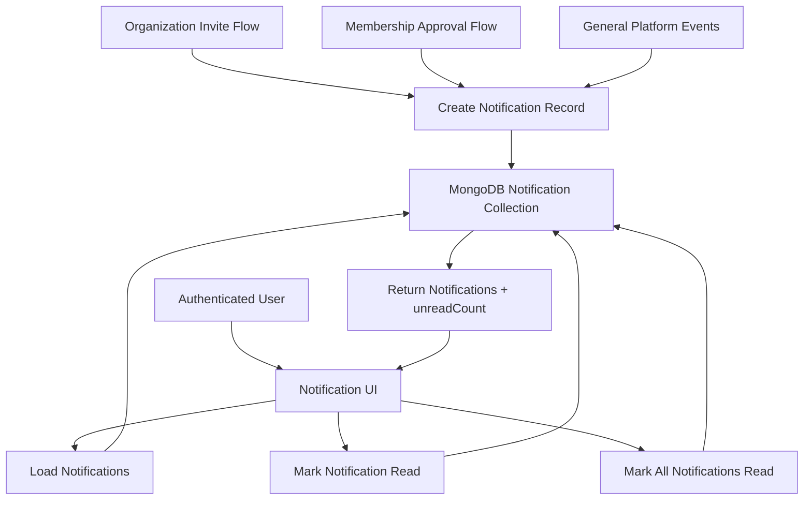
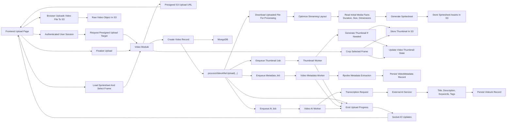
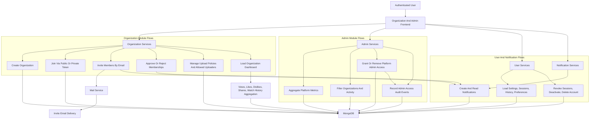

# SK-MediaFlow

`SK-MediaFlow` is a full-stack video platform for publishing, organizing, streaming, and managing media at individual, organization, and platform-admin levels. The current codebase combines creator workflows, AI-assisted metadata, S3-backed ingestion, background processing, and analytics-oriented administration in a single product surface.

## What The Project Currently Includes

- Email/password authentication with OTP verification, password reset, and Google OAuth
- User profiles with avatar and cover management
- Channel-based publishing
- Direct video uploads with presigned S3 URLs
- S3 bucket registration, scanning, and selective import
- Public, private, and organization-scoped video visibility
- Landscape and portrait playback flows
- AI-generated transcript, title, description, keywords, and tags
- Spritesheet generation and frame-based thumbnail selection
- Reactions, comments, shares, favorites, playlists, and watch history
- Organization creation, join flows, invite flows, uploader policy controls, and dashboard metrics
- Platform admin analytics, subscription visibility, and admin access management
- Real-time processing updates through Socket.IO

## Architecture

### Frontend

- React 19
- TypeScript
- Vite 7
- React Router 7
- Axios
- Socket.IO client
- Tailwind CSS 4
- Framer Motion

### Backend

- Node.js
- Express
- TypeScript
- Prisma ORM
- MongoDB
- BullMQ with Redis
- AWS S3
- CloudFront signed delivery
- FFmpeg and ffprobe
- Passport Google OAuth
- JWT-based auth flows

### AI And Processing

- External AI service integration through backend AI modules
- Queue-backed workers for thumbnailing, AI enrichment, and technical metadata extraction
- Post-upload media orchestration for optimization, spritesheets, and downstream jobs

## Project Flowchart


## Detailed Flowcharts

### Authentication flow



### User settings and security flow



### Profile and media management flow



### S3 import flow



### Playback access flow



### Video interaction and analytics flow



### AI suggestion lifecycle



### Notification flow



## Repository Layout

```text
SK-MediaFlow/
├── README.md
├── PROJECT_OVERVIEW.md
├── SETUP_GUIDE.md
├── SKILLS_DEVELOPED.md
├── WHISPER_OLLAMA_USAGE.md
├── backend/
└── frontend/
```

## Codebase Overview

The repository is split into two main applications:

- `backend/` for authentication, media orchestration, persistence, worker execution, queue handling, and real-time progress events
- `frontend/` for playback, uploads, discovery, profile management, organization tools, and admin workflows

Important backend entry files:

- `backend/src/app.ts`
  Express app setup, middleware registration, route mounting, and worker imports

- `backend/src/server.ts`
  HTTP server creation, Socket.IO setup, and progress event wiring

- `backend/prisma/schema.prisma`
  Prisma schema for the MongoDB data model

Important frontend entry files:

- `frontend/src/main.tsx`
- `frontend/src/App.tsx`
- `frontend/src/layouts/AppLayout.tsx`

## Frontend Surface

The frontend is a protected single-page application centered on content discovery, playback, upload, and account management.

Key routes implemented in `frontend/src/App.tsx`:

- `/login`
- `/register`
- `/oauth-success`
- `/reset-password`
- `/video/:publicId`
- `/portrait`
- `/portrait/:publicId`
- `/home`
- `/upload`
- `/s3-import`
- `/favorites`
- `/playlists`
- `/profile`
- `/settings`
- `/search`
- `/organization`
- `/organization/dashboard`
- `/admin`

Main frontend areas:

- `frontend/src/pages` for product screens
- `frontend/src/components` for reusable media and navigation UI
- `frontend/src/layouts` for authenticated app shells
- `frontend/src/context` for auth and layout state
- `frontend/src/api` for backend integration

Notable frontend pages and components:

- `frontend/src/pages/Home.tsx` for discovery and featured media presentation
- `frontend/src/pages/Upload.tsx` for upload progress, AI state, and thumbnail selection
- `frontend/src/pages/ProfilePage.tsx` for profile editing and owned-video management
- `frontend/src/pages/AdminDashboard.tsx` for platform-level oversight
- `frontend/src/components/SpritesheetPicker.tsx` for frame-based thumbnail selection
- `frontend/src/context/AuthContext.tsx` for session and authentication state

Notable user-facing experiences:

- cinematic home feed with hero and row-based discovery
- upload workflow with processing progress and thumbnail selection
- S3 import workflow for existing bucket media
- profile library management for uploaded videos
- account settings covering notifications, privacy, preferences, sessions, and account lifecycle actions
- organization workspace and organization dashboard views
- platform admin reporting dashboard

## Backend Surface

The backend is an Express service layer with modular domain areas and background workers.

Primary backend domains:

- Auth module
  Registration, OTP verification, login, password reset, session-end tracking, and Google OAuth

- User module
  Profile data, avatar and cover updates, settings, session management, watch history cleanup, and account deactivate/delete actions

- Channel module
  Channel creation and maintenance

- Video module
  Upload completion, listing, search, portrait feeds, channel-scoped listings, spritesheet retrieval, thumbnail saving, owned-video updates, deletion, and S3 import helpers

- Video actions module
  Interaction flows such as views, likes, dislikes, comments, shares, watch events, and playlist linkage

- Organization module
  Organization creation, join links, invite workflows, member approval, uploader permissions, billing and subscription state, and organization-level content analytics

- Admin module
  Platform metrics, filter data, privileged user management, and admin access audit tracking

- Notification module
  Notification retrieval and state updates

- AI module
  AI metadata generation and application flows for videos

Key backend services and workers:

- Video processing orchestration
  Main post-upload orchestration for optimization, spritesheets, and queue dispatch

- Video metadata service
  Technical metadata extraction including duration, dimensions, codecs, and orientation

- Thumbnail service
  Thumbnail generation when a usable thumbnail does not already exist

- Realtime service
  Progress and completion event emission for the frontend

- Thumbnail worker
- Video AI worker
- Video metadata worker

## Data Model Highlights

The Prisma schema in `backend/prisma/schema.prisma` models:

- users, login sessions, and channels
- videos, AI records, and technical metadata
- reactions, comments, shares, watch history, and playlists
- organizations, memberships, invites, uploader access, and subscription state
- notifications
- admin access audits
- user-scoped S3 credentials

Video visibility supports:

- `PUBLIC`
- `PRIVATE`
- `ORGANIZATION`

Upload sources support:

- `MANUAL`
- `S3_IMPORT`

## Media Pipeline

Current upload and processing flow:

1. The client requests a presigned upload target.
2. The media file is uploaded to S3.
3. The client finalizes the upload flow.
4. The backend creates the video record and starts post-upload orchestration.
5. Processing generates optimized media outputs and a spritesheet.
6. Background jobs enrich AI data, thumbnails, and technical metadata.
7. Real-time events report progress back to the frontend.

Upload processing flow:



Organization and admin flow:



Current media-related capabilities in the codebase:

- presigned video uploads
- presigned thumbnail uploads
- spritesheet retrieval for frame picking
- CloudFront signed access for protected assets
- technical metadata extraction including duration, dimensions, codecs, and orientation

## Background Jobs And Workers

Worker entrypoint:

- `backend/src/workers/index.ts`

Registered worker areas:

- `backend/src/workers/thumbnail.worker.ts`
- `backend/src/workers/video-ai.worker.ts`
- `backend/src/workers/video-metadata.worker.ts`

These workers back the asynchronous parts of the media pipeline and keep expensive processing out of the request path.

Queue names used by the processing pipeline:

- `thumbnailQueue`
- `videoAIQueue`
- `videoMetadataQueue`

## AI Runtime

Whisper-style transcription and Ollama-style generation are not embedded directly in the main backend process. The repository delegates both steps to an external AI service configured through `AI_SERVER_URL`.

At a high level:

- transcription is handled as a Whisper-like step
- metadata generation is handled as an Ollama or general LLM-style step
- the video AI worker coordinates both steps and stores the output in `videoAI`

The worker-driven AI flow:

1. A video upload or import creates a pending `videoAI` record.
2. A job is added to `videoAIQueue`.
3. `backend/src/workers/video-ai.worker.ts` downloads the source video from S3.
4. The worker extracts audio with FFmpeg into MP3 form.
5. The worker sends audio to the external transcription service.
6. The worker sends the transcript to the external generation service.
7. The worker normalizes the response and stores transcript, title, description, keywords, and tags.
8. Real-time events notify the frontend about progress, completion, or failure.

Relevant AI files:

- `backend/src/workers/video-ai.worker.ts`
- `backend/src/modules/ai/ai.service.ts`
- `backend/src/utils/extract-audio.ts`
- `frontend/src/pages/Upload.tsx`

Typical `videoAI` fields populated by the worker:

- `transcript`
- `aiTitle`
- `aiDescription`
- `keywords`
- `tags`
- `status`

AI progress events used by the frontend:

- `ai-progress`
- `ai-completed`
- `ai-failed`

Common AI failure points:

- audio extraction fails before transcription begins
- the external AI service is unreachable
- generation returns malformed or incomplete structured output
- Redis or workers are unavailable, so `videoAIQueue` jobs are not consumed
- Socket.IO wiring prevents progress updates from reaching the upload UI

## Runtime Requirements

Running the full product requires more than installing dependencies.

Required services and infrastructure:

- MongoDB
- Redis
- AWS S3
- CloudFront signing setup
- FFmpeg and ffprobe available on the machine
- an external AI service reachable through `AI_SERVER_URL`

Important environment areas:

- database connection settings
- JWT secret and auth configuration
- AWS and CloudFront configuration
- Google OAuth configuration
- Redis connection settings
- AI service location
- email delivery settings
- client application URLs

## Operational Notes

- Prisma is configured for MongoDB.
- Media storage and generated assets are designed around S3 plus CloudFront delivery.
- AI enrichment is not self-contained in this repository; it depends on an external service integration.
- The application uses request/response services and Socket.IO to complete the upload and processing experience.
- Worker processes are required for AI, metadata, and thumbnail jobs to complete reliably.
- Setup steps and environment details are intentionally not included in this README.

## Additional Documentation

- [SETUP_GUIDE.md](./SETUP_GUIDE.md)
- [SKILLS_DEVELOPED.md](./SKILLS_DEVELOPED.md)
