# SK-MediaFlow

## Platform Overview

### Purpose

`SK-MediaFlow` is a full-stack video publishing and streaming platform for creators, teams, and organizations. It supports secure video upload, cloud-backed storage, signed media delivery, AI-assisted content enrichment, organization workflows, analytics, and in-app notifications.

### Important Info

- Users can create accounts, verify identity, manage profiles, and publish videos.
- Videos can be public, private, or organization-scoped.
- Media assets are stored in cloud object storage and delivered through signed CDN URLs.
- AI generation is user-driven and only starts when the user explicitly selects it.
- Notifications are generated for video, channel, subscription, and organization activity.

### Flowchart

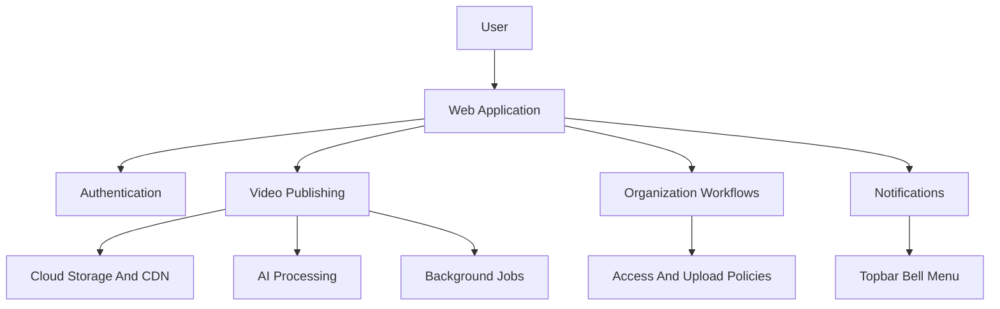

## Core Capabilities

### Purpose

This section summarizes the major product areas supported by the platform.

### Important Info

- Email and Google-based sign-in are supported.
- User profiles, avatars, covers, and channel identities are available.
- Manual upload and selective cloud bucket import are supported.
- AI can generate transcript, title, description, keywords, tags, thumbnails, and spritesheet assets.
- Users can like, dislike, comment, share, subscribe, save favorites, build playlists, and resume watch history.
- Organizations support invites, join requests, approvals, uploader policies, roles, dashboards, and metrics.
- Admins can review platform-level analytics and manage access.

### Flowchart

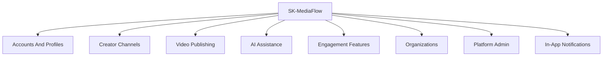

## Technology Stack

### Purpose

This section explains the major technologies used by the frontend, backend, storage, delivery, and processing layers.

### Important Info

- The frontend is built with React, TypeScript, Vite, routing, HTTP client utilities, socket communication, utility styling, motion, and icon components.
- The backend is built with Node.js, Express, TypeScript, Prisma, MongoDB, job queues, Redis, cloud object storage, CDN signing, FFmpeg tooling, email delivery, OAuth, and token-based authentication.
- Real-time status updates are delivered over sockets.
- Long-running media and AI tasks run through background workers.

### Flowchart

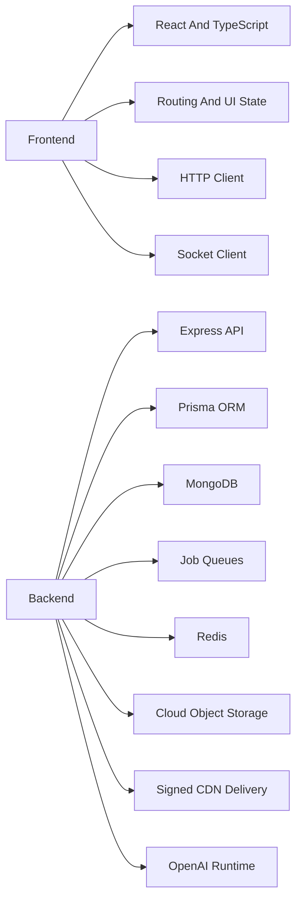

## High-Level Architecture

### Purpose

This section shows how the user interface, backend API, database, storage, CDN, sockets, queues, and workers fit together.

### Important Info

- The frontend calls the backend API for authenticated application actions.
- The backend stores application data in MongoDB through Prisma.
- Videos, thumbnails, spritesheets, and generated assets live in cloud object storage.
- Signed CDN URLs are used for playback and protected media delivery.
- Background workers process metadata, thumbnails, spritesheets, and AI output.
- Real-time events keep the upload and processing UI current.

### Flowchart

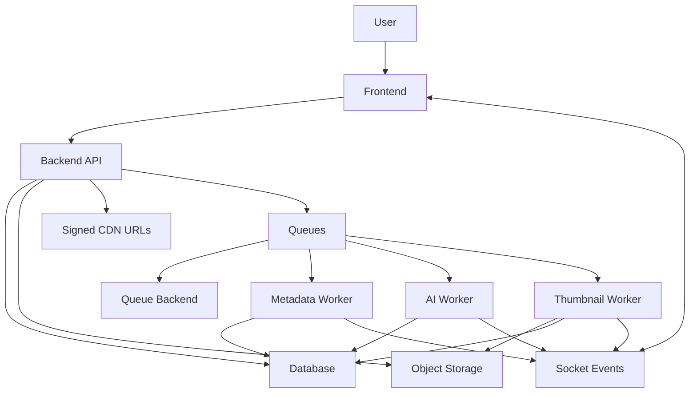

## Authentication And Accounts

### Purpose

This section describes how users enter and maintain access to the platform.

### Steps And Important Info

1. A user registers or signs in through a supported provider.
2. Verification and session checks protect account access.
3. Login sessions are tracked so invalid or revoked sessions can be rejected.
4. Profile settings, security settings, and account lifecycle controls are available after sign-in.
5. Protected product areas require a valid signed-in user.

### Flowchart

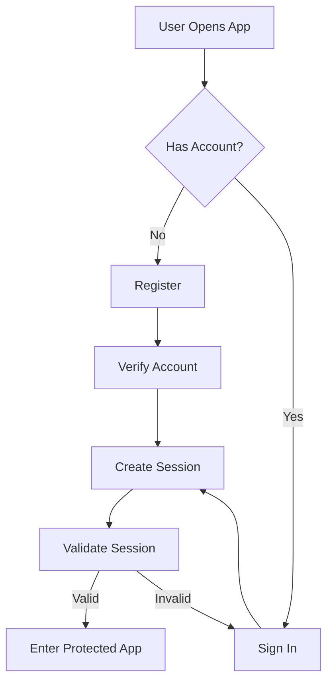

## Profile And Channel Management

### Purpose

This section explains how users represent themselves and publish under a channel identity.

### Steps And Important Info

1. A user manages profile details, avatar, cover image, and preferences.
2. A channel identity is used for video publishing and subscriptions.
3. Other users can discover channel content and subscribe.
4. Channel ownership controls private and organization-scoped video management.

### Flowchart

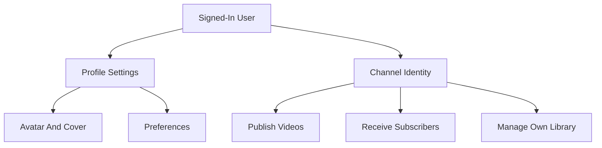

## Upload And Publishing

### Purpose

This section describes how a user publishes a video through the normal upload flow.

### Steps And Important Info

1. The user selects a video.
2. The user either provides a manual thumbnail or chooses AI generation before upload.
3. The frontend requests signed upload permissions.
4. Media is uploaded directly to cloud storage.
5. The backend creates the video record after upload completion.
6. Technical metadata processing is queued.
7. The user receives an upload-complete notification.
8. Subscribers may receive a new-video notification.

### Flowchart

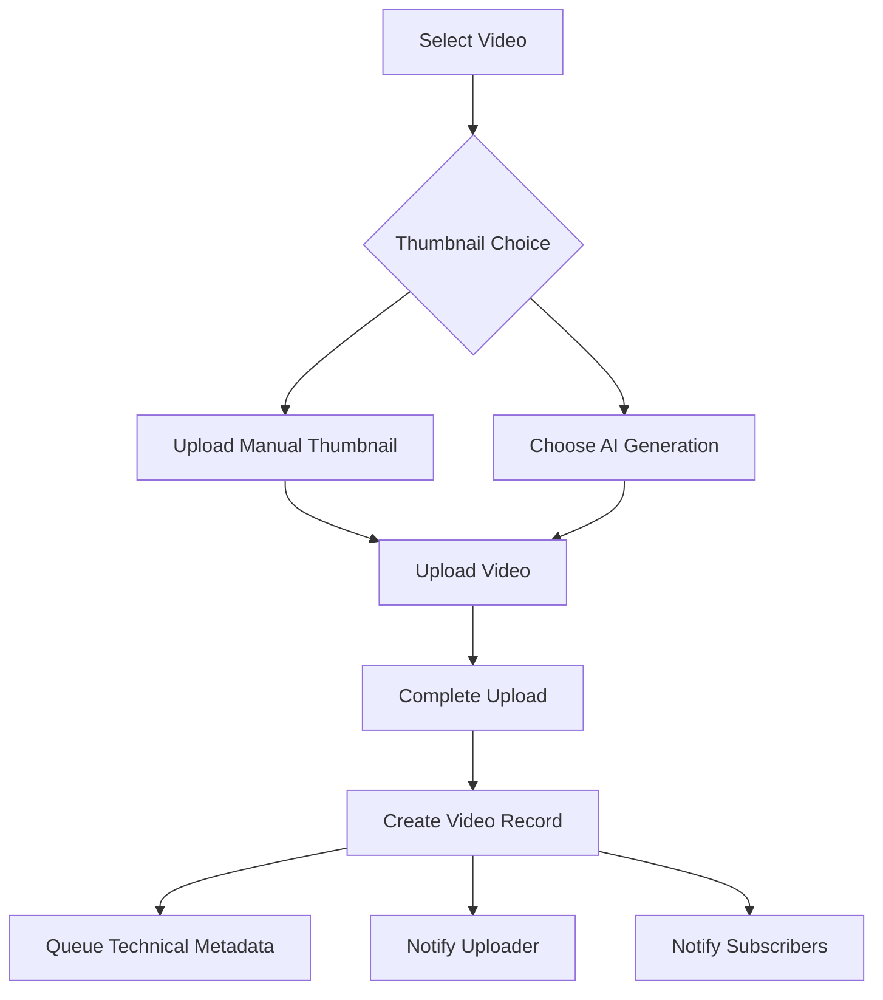

## Manual Thumbnail Flow

### Purpose

This section explains the direct thumbnail path where the user supplies the thumbnail.

### Steps And Important Info

1. The user selects a thumbnail before upload completion.
2. The frontend uploads the thumbnail to storage.
3. The video record is created with the selected thumbnail.
4. AI thumbnail generation does not replace the manual thumbnail automatically.
5. The user can later pick another frame from a spritesheet if available.

### Flowchart

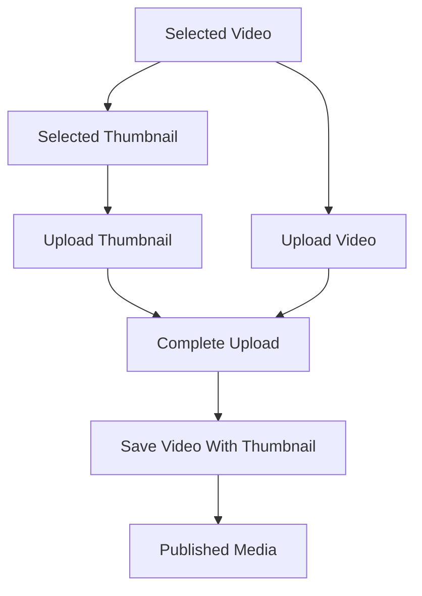

## AI Generation Flow

### Purpose

This section explains the AI-assisted path where the user explicitly asks the platform to generate content assets.

### Steps And Important Info

1. The user selects Generate AI before upload starts.
2. A confirmation explains what will be generated.
3. The user confirms generation.
4. Upload can complete without a manual thumbnail.
5. AI metadata, AI thumbnail, and spritesheet work are queued once.
6. Socket events update the upload UI as work progresses.
7. AI and thumbnail failures are not retried automatically.

### Flowchart

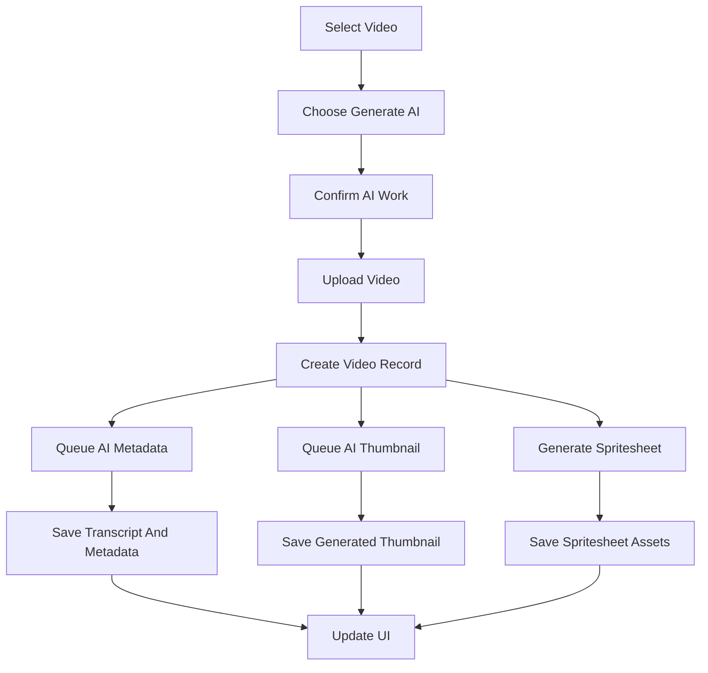

## AI Processing Rules

### Purpose

This section defines guardrails for when AI jobs are allowed to run.

### Steps And Important Info

1. AI processing starts only after user confirmation.
2. Jobs are marked as user-requested.
3. Workers skip AI or thumbnail jobs that were not explicitly requested.
4. Duplicate AI requests are blocked by stored status and stable job identity.
5. AI and thumbnail jobs use single-attempt execution.
6. Normal browsing cards do not expose Generate AI; the decision is made during upload.

### Flowchart

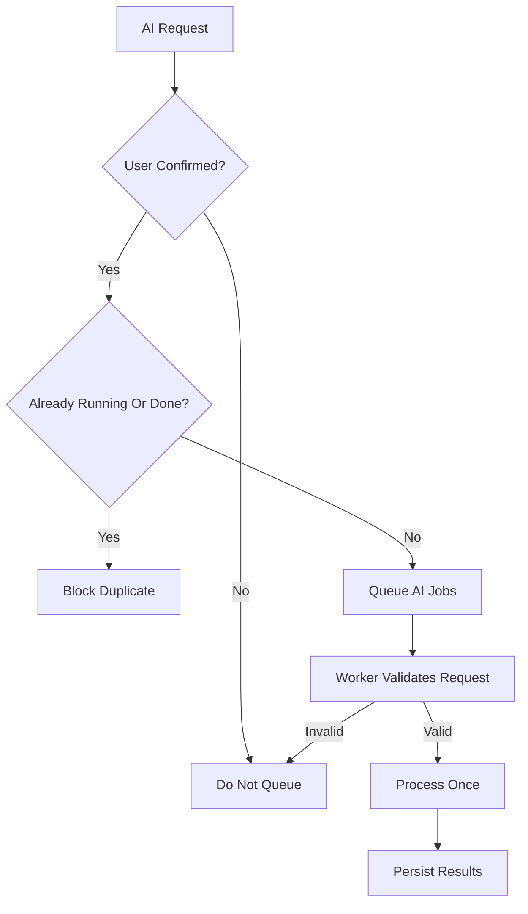

## S3 Import Flow

### Purpose

This section explains how users import existing videos from a connected cloud bucket.

### Steps And Important Info

1. A user registers external bucket credentials.
2. The platform scans available objects.
3. The user selects videos to import.
4. Selected objects are copied into the platform storage area.
5. Thumbnails and records are created.
6. Processing is queued.
7. Import-complete and subscriber notifications are generated.

### Flowchart

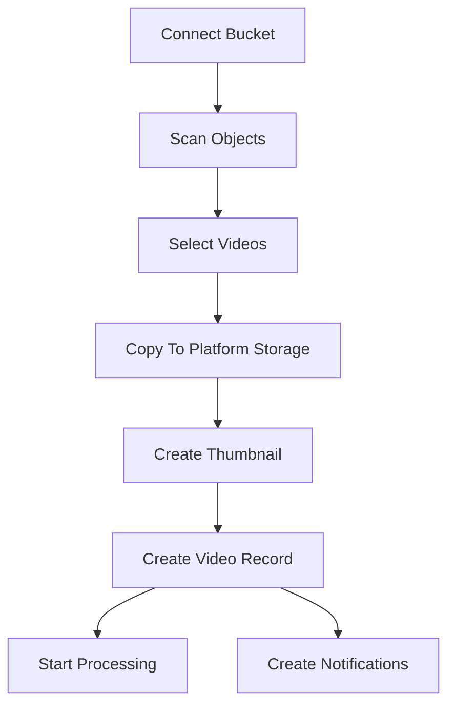

## Media Pipeline

### Purpose

This section explains how uploaded or imported media becomes playable and enriched.

### Steps And Important Info

1. The backend records the uploaded or imported media.
2. Playback URLs are signed before use.
3. Technical metadata is extracted for duration, orientation, and layout.
4. Optional AI metadata and thumbnail generation run after user confirmation.
5. Spritesheet assets can be generated for frame-based thumbnail selection.
6. Generated assets are saved back to storage and database records.

### Flowchart

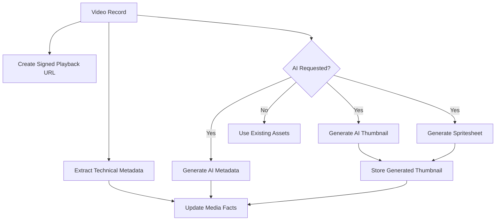

## Background Jobs And Workers

### Purpose

This section describes how asynchronous processing keeps slow media work outside request-response flows.

### Steps And Important Info

1. User actions create records and enqueue work.
2. Queues hand jobs to workers.
3. Workers process metadata, AI output, thumbnails, and spritesheets.
4. Workers update database and storage state.
5. Socket events report progress and completion to the frontend.
6. Workers must be running for background processing to finish.

### Flowchart

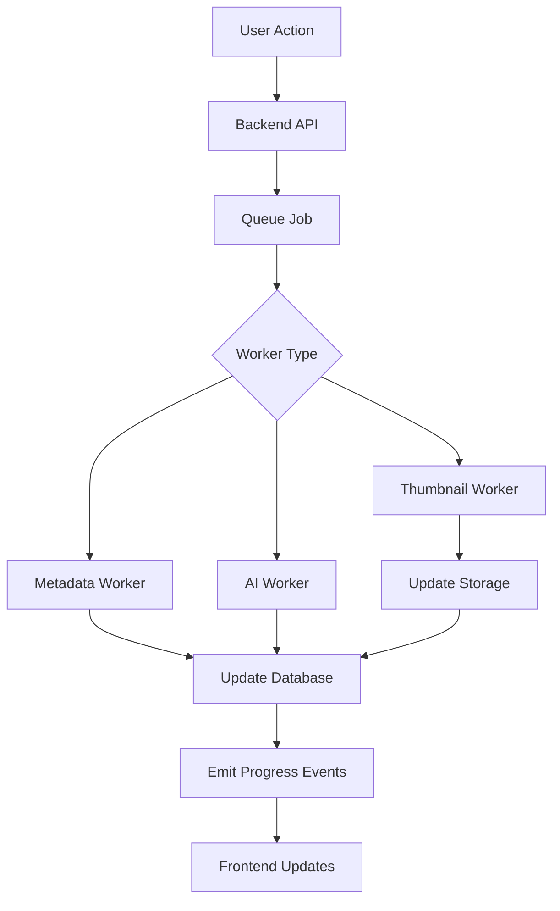

## Playback And Discovery

### Purpose

This section explains how users browse, search, and watch videos.

### Steps And Important Info

1. The frontend requests videos the current user is allowed to see.
2. The backend applies public, private, and organization visibility rules.
3. Search uses video title, AI title, AI description, keywords, and tags.
4. Signed media URLs are returned for playable videos.
5. Watch progress and recent activity can be recorded for signed-in users.

### Flowchart

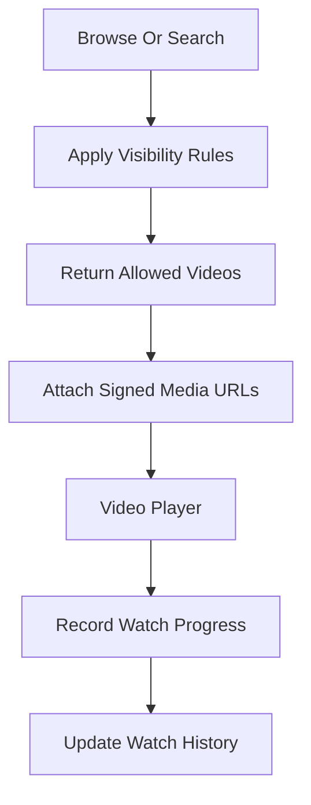

## Video Actions

### Purpose

This section explains user engagement actions around videos.

### Steps And Important Info

1. Users can view, like, dislike, comment, share, save to playlist, and subscribe.
2. Duplicate reactions are normalized so each user has one reaction per video.
3. Comments and shares update video activity counts.
4. Subscription changes update channel subscriber counts.
5. Likes, comments, shares, and subscriptions create notifications when appropriate.

### Flowchart

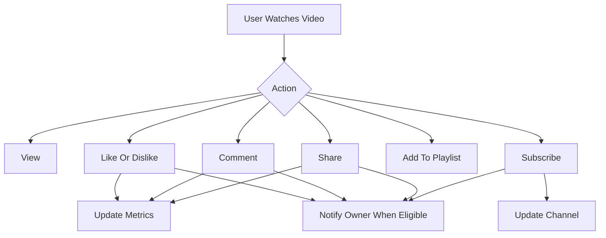

## Notifications

### Purpose

This section explains how in-app notifications are created, read, and displayed.

### Steps And Important Info

1. Backend events create notification records.
2. Uploaders are notified when uploads or imports complete.
3. Subscribers are notified when followed channels upload or update videos.
4. Video owners are notified when other users like, comment on, or share their videos.
5. Channel owners are notified when another user subscribes.
6. Organization events notify affected users or admins.
7. The topbar polls while a user is signed in.
8. Opening the bell menu force-refreshes the list.
9. Read-state changes update both backend state and local cache.
10. Notification creation is best-effort and should not block the original user action.

### Flowchart

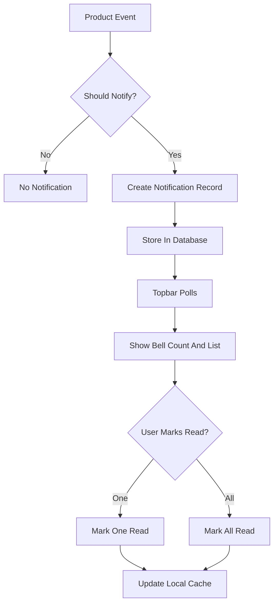

## Organization Workflows

### Purpose

This section explains team and organization behavior for membership, access, and content policy.

### Steps And Important Info

1. A user creates or joins an organization.
2. Join requests may require admin approval.
3. Invites can add users through organization-controlled flows.
4. Admins can approve members, promote roles, remove access, and manage upload policy.
5. Organization visibility controls who can view organization-scoped content.
6. Organization actions create notifications for affected users and admins.

### Flowchart

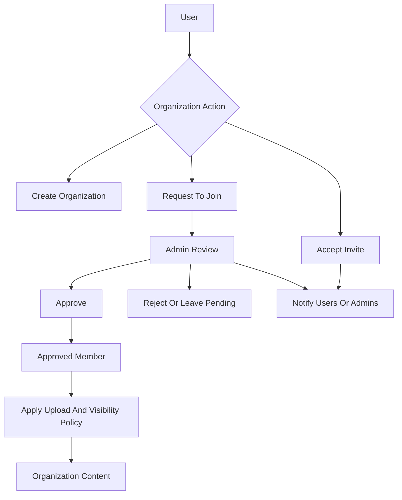

## Admin And Platform Metrics

### Purpose

This section describes platform-level monitoring and access control.

### Steps And Important Info

1. Platform admins can review aggregate usage and activity.
2. Admin tools can filter and inspect users, videos, and organizational data.
3. Access controls protect admin-only areas.
4. Admin actions should be auditable.

### Flowchart

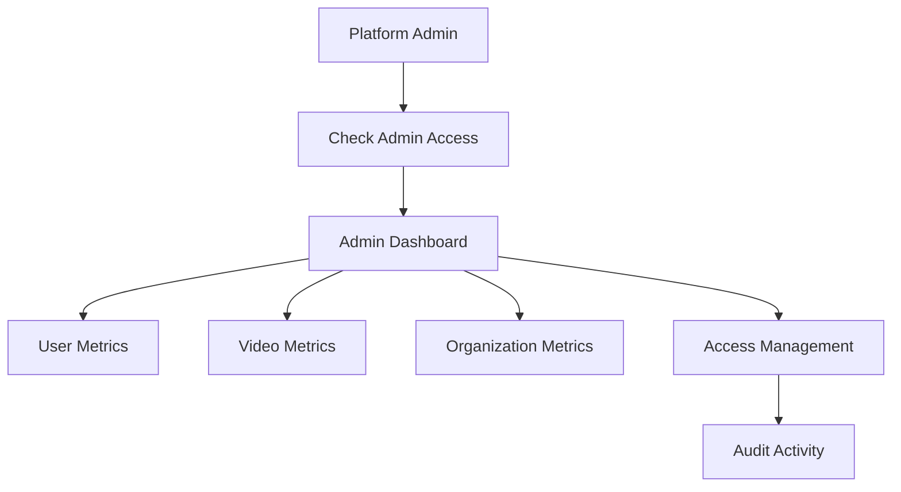

## Frontend Experience

### Purpose

This section explains the main user-facing areas without listing internal file names or route paths.

### Steps And Important Info

1. Public entry screens handle sign-in, registration, password recovery, and provider callbacks.
2. Protected application screens include home, upload, cloud import, player, portrait playback, favorites, playlists, profile, settings, search, organization, and admin areas.
3. Shared layout components provide navigation, user account controls, and notifications.
4. The upload UI owns the Generate AI decision before upload starts.

### Flowchart

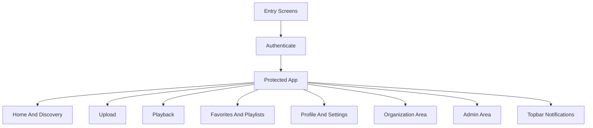

## Runtime Requirements

### Purpose

This section explains what external services and runtime support the application needs.

### Important Info

- A database is required for users, videos, organizations, notifications, and activity.
- A queue backend is required for background jobs.
- Cloud object storage is required for videos, thumbnails, spritesheets, and generated assets.
- A CDN with signing support is required for protected media delivery.
- AI processing requires access to the configured AI provider.
- Email delivery is required for OTP and password recovery flows.
- OAuth credentials are required when provider sign-in is enabled.
- Workers must be running for metadata, AI, thumbnail, and spritesheet processing.

### Flowchart

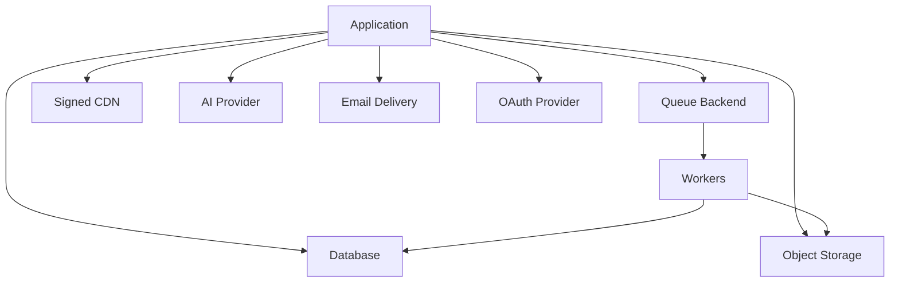

## Verification

### Purpose

This section describes how to validate that major application layers still work after changes.

### Steps And Important Info

1. Run the backend build to validate server-side TypeScript.
2. Run the frontend build to validate client-side TypeScript and production bundling.
3. Verify upload with manual thumbnail.
4. Verify upload with AI generation selected.
5. Verify notification creation after upload, import, video update, like, comment, share, subscription, and organization activity.
6. Verify the notification bell refreshes on open and read-state updates correctly.

### Flowchart

```mermaid
flowchart TD
    START["Start Verification"] --> BACKEND["Backend Build"]
    START --> FRONTEND["Frontend Build"]
    BACKEND --> UPLOAD1["Manual Upload Check"]
    FRONTEND --> UPLOAD1
    UPLOAD1 --> UPLOAD2["AI Upload Check"]
    UPLOAD2 --> ACTIONS["Video Action Checks"]
    ACTIONS --> NOTIF["Notification Checks"]
    NOTIF --> READ["Read-State Checks"]
    READ --> DONE["Ready"]
```

## Operational Notes

### Purpose

This section captures behavior that operators and maintainers should keep in mind.

### Important Info

- AI and thumbnail processing is intentionally opt-in and single-attempt.
- Metadata processing may still run for uploaded or imported videos because playback and layout depend on media facts.
- Media and generated assets are stored externally and served through signed URLs.
- Redis-backed queues and workers are required for asynchronous processing.
- Notification failures are logged and should not block the original user action.
- Signed-in users should see notification updates through polling and forced refresh on bell open.

### Flowchart

```mermaid
flowchart TD
    OPS["Operate Platform"] --> SERVICES["Keep Services Running"]
    SERVICES --> DB["Database Healthy"]
    SERVICES --> QUEUE["Queue Backend Healthy"]
    SERVICES --> STORAGE["Storage Healthy"]
    SERVICES --> WORKERS["Workers Running"]
    SERVICES --> AI["AI Provider Available"]
    OPS --> WATCH["Monitor Failures"]
    WATCH --> NOTIF["Notification Failures Are Non-Blocking"]
    WATCH --> MEDIA["Media Processing Issues Need Worker Checks"]
```
